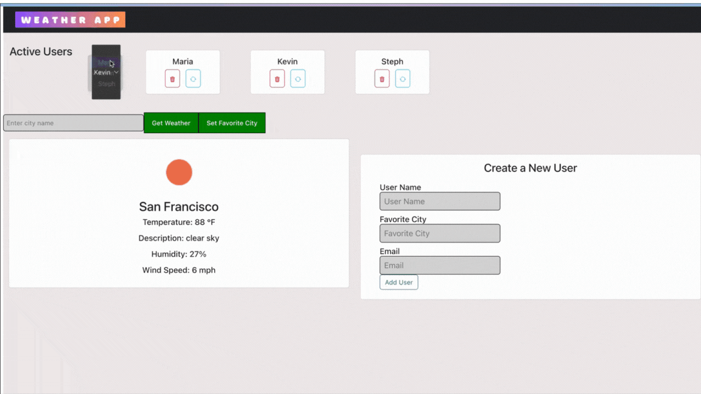

# Weather App

## Overview
The Weather App is a personalized, easy-to-use web application that displays the current weather of your favorite city. When you create a new user, you're asked to create a username, input your favorite city and your email. This project was created for week 11's Techtonica program assignment. The system uses a React frontend and a Node.js backend to create an interactive UI.

## Demo

